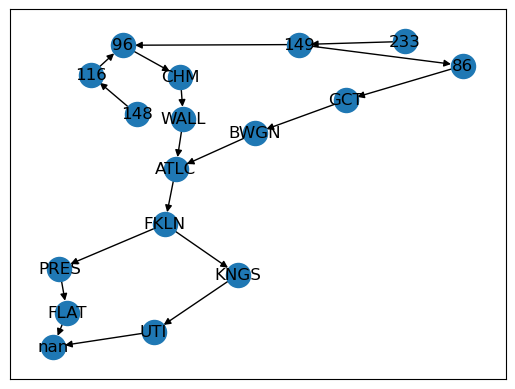
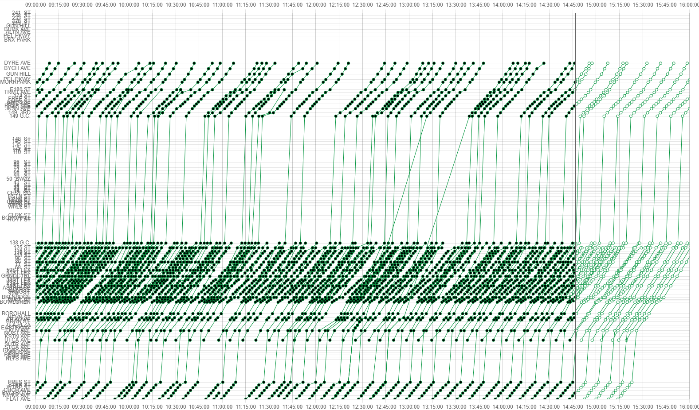

# Stringlines Informational Repo

This repo contains the documentation for the Stringlines web app I developed during my time at the MTA. The project itself contains certain intellectual property of the MTA, so I cannot make it public yet. Therefore this is intended to showcase the project in the meantime.

# App Description

This is a reimplementation of the classic NYCT Subway Stringlines tool, using [React](https://reactjs.org/) and [Chart.js](https://www.chartjs.org/). It is designed for (relative) ease of maintenance, extensibility, and compatibility with newer web technologies and more robust data infrastructure.

It also includes the first implementation of **Bus Stringlines!**

This repo also includes the "AJT Diagnostic Tool" that was developed to aid in the AJT decomposition project -- see [here](#ajt-diagnostic-tool-ajt-util) and the `ajt-util` branch.

As of January 2023, this app is running in a Docker container at `[hostname]:8500`. The container and the repo are located in the `stringlines` user profile on that machine. See [Docker Deployment](#docker-deployment) for more info.

- [Stringlines Informational Repo](#stringlines-informational-repo)
- [App Description](#app-description)
- [Authors](#authors)
- [Getting Started](#getting-started)
  - [Requirements](#requirements)
  - [Running in Development Mode](#running-in-development-mode)
  - [Running in Production Mode](#running-in-production-mode)
  - [Docker Deployment](#docker-deployment)
    - [Docker Cleanup](#docker-cleanup)
- [User Guide](#user-guide)
  - [Subway Stringlines](#subway-stringlines)
  - [Bus Stringlines](#bus-stringlines)
    - [**Note about bus data**](#note-about-bus-data)
  - [Bus Matching Debugger (experimental)](#bus-matching-debugger-experimental)
- [AJT Diagnostic Tool (ajt-util)](#ajt-diagnostic-tool-ajt-util)
- [Data Sources](#data-sources)
  - [Subway](#subway)
  - [Bus](#bus)
- [Chart.js Inner Workings](#chartjs-inner-workings)
  - [Interaction with React](#interaction-with-react)
  - [Data](#data)
  - [Options](#options)
  - [Styling](#styling)
  - [Tooltip](#tooltip)
  - [Chart Ref](#chart-ref)
- [Stop Ordering Algorithm](#stop-ordering-algorithm)
  - [Description](#description)
  - [Solution](#solution)
- [Roadmap: See also issues in MTA GitLab](#roadmap-see-also-issues-in-mta-gitlab)
  - ["Easier": within existing app](#easier-within-existing-app)
  - ["Harder": more fundamental changes](#harder-more-fundamental-changes)
- [Contributing](#contributing)

# Authors

Jonah Stadtmauer

# Getting Started

This project was bootstrapped with [Create React App](https://github.com/facebook/create-react-app).\
You can learn more in the [Create React App documentation](https://facebook.github.io/create-react-app/docs/getting-started).\
To learn React, check out the [React documentation](https://reactjs.org/).

## Requirements

Running this app requires [node](https://nodejs.org/) to be installed on your machine. **Minimum version: v16**. You must also be able to access the npm package registry to install the necessary dependencies with npm. For development, it is highly recommended to use VS Code with the Prettier and ESlint plugins installed.

Deploying a Docker container also requires [Docker](https://www.docker.com/) to be installed.

## Running in Development Mode

When in development mode, the frontend (any files in the [src/](/src/) and [public/](/public/) folders) will update to changes you make as you modify the code. However, the backend will not. To reflect changes made to the backend, you must restart the `server.js` process.

Navigate to the project's root directory and execute the following commands in the terminal:

1. **`npm i`**

   - Same as `npm install`, this command installs all the dependencies as specified in [package.json](package.json).

2. **`node server.js`**

   - This starts the backend server, which responds to fetch requests from the frontend.
   - See [Proxying API Requests in Development](https://create-react-app.dev/docs/proxying-api-requests-in-development).

3. **`npm start`**

   - This starts the development server, which serves the frontend development bundle and rerenders live when you make changes. You may also see any lint errors in the console.

4. **Open [http://localhost:3000](http://localhost:3000) to view it in your browser.**

   - The webpage will reload when you make changes to the code.

## Running in Production Mode

Navigate to the project's root directory and execute the following commands in the terminal:

1. **`npm i`**

2. **`npm run build`**

   - This builds the app for production to the `build` folder.\
     It correctly bundles React in production mode and optimizes the build for the best performance.
   - The build is minified and the filenames include the hashes.

3. **`node server.js`**

   - This starts the backend server, which now also serves the `build` folder with the app bundle. It also functions as the backend for the app, just as in development mode.

   - See [Proxying API Requests in Development](https://create-react-app.dev/docs/proxying-api-requests-in-development).

4. **Open [http://localhost:3001](http://localhost:3001) to view it in your browser.**

   - The webpage will not reflect any changes made to the code, unless you rebuild the app by running `npm run build` again.

## Docker Deployment

Deploying with Docker performs a number of processes specified in the [Dockerfile](./Dockerfile) to run this app in production mode. Essentially, it automatically follows the steps to run the production build inside a lightweight container.

First, it creates a lightweight linux environment with node installed. Next, it copies the repo into the environment. Then it runs the commands to install all of the project's dependencies with `npm`. Then it runs `npm run build`, exposes port 3001 to the host machine, and finally runs `node server.js`.

**On the server where you plan to deploy the docker container:**

1. `git clone` this repo and navigate to the project's root directory.
2. `docker build . -t <image-tag>`

   - This builds a new docker image, but does not spin up a container yet.
   - `<image-tag>` is a name you give to the docker image.

3. `docker run --name <container-name> -p <some-port>:3001 -d <image-tag>`

   - This spins up a new docker container from the image with tag `<image-tag>`.
   - The `-d` flag runs the container in detached mode.
   - The `--name` flag gives the container the name specified by `<container-name>`.
   - The `-p` flag allows for port forwarding, in this case from `<some-port>` on the host machine to `3001` inside the docker container. **Specify a port that is not being used on the host machine.**
   - This makes the app accessible to the network on the host machine port `<some-port>`.

### Docker Cleanup

To stop a docker container:

```
docker stop <container-name>
```

To remove (delete) a docker container:

```
docker rm <container-name>
```

To remove (delete) a docker image:

```
docker rmi <image-tag>
```

# User Guide

For this guide, we will assume that the app is hosted at [http://localhost:3000](http://localhost:3000).

To begin, navigate to the homepage. You should see links leading to both Subway Stringlines and Bus Stringlines:


## Subway Stringlines

Subway Stringlines allows the user to view both real-time and historical subway service. To begin, navigate to [http://localhost:3000/subway](http://localhost:3000/subway).

The subway page attempts to emulate the classic stringlines as closely as possible, with the current date's northbound (1) train being selected by default:


When viewing the current day, the movement data will be automatically refetched from the server every 30 seconds. In the future, this should be changed to a push-based system.

Hover over a stop circle to display the tooltip. The tooltip contains the following information about the focused stop/trip:

- time of stop (or forecasted time)
- name of station
- ID of station
- subway bullet icon
- train ID
- lead/last car numbers
- operator number
- conductor number
- comments


Click on any point to highlight the trip:


Click anywhere on the background of the graph to clear the selection.

Click the _Last Updated_ button to manually refetch the data from the server.

_Data Source_ allows the user to change the source of train data that the app fetches from. Datamart is selected by default, as it is usually more reliable. See [Data Sources](#data-sources) for more details.

The _Stations_ dropdown menu allows the user to select a single "primary" subway line, which determines the stations shown on the Y-axis.

The _Trains_ dropdown dictates which actual train movements will be plotted on the graph. Any number of trains can be selected, but note that only trains that share stops with the primary line will be visible.

Train movements belonging to the primary line are plotted with a bold line, while secondary train movements are plotted with thin lines. Here is an example of a graph with the (4) and (5) trains shown, with the (5) selected as the primary line:


Here is an example of a graph with the (2) and (5) trains shown, with the (4) selected as the primary line:


## Bus Stringlines

Bus Stringlines allows the user to view only historical bus service, as it is reliant on the next-day bus matching process. To begin, navigate to [http://localhost:3000/bus](http://localhost:3000/bus).


The user flow is somewhat different from Subway Stringlines, requiring the user to take the following steps:

1. Select a date.
2. Select a bus route.
3. Choose a path of the selected route.

Steps 2) and 3) support searching:


The paths dropdown displays the path IDs, the SRT type (LCL/LTD/EXP/SCH/SBS), and the direction (NB/SB/EB/WB). To view the first and last stops on a path, simply hover over the option to display a tooltip:


Currently, only one path may be selected at a time. The future roadmap includes implementation of a [stop ordering algorithm](#stop-ordering-algorithm) that can take in any number of paths and dynamically order the stops linearly.

If the chart displays "No data available", choose a different date + route combination. **Remember that data is only available with a 1-2 day lag due to the nature of the bus matching process.**

Once a date, route, and path have been selected, the graph displays the bus movements as in the subway version:


The tooltip includes the following information about the focused stop/trip:

- time of stop
- name of bus stop
- ID of bus stop
- MTA logo
- bus route ID
- SRT type; one of:
  - LCL
  - LTD
  - EXP
  - SBS
  - SCH
- direction; one of:
  - NB
  - SB
  - EB
  - WB
- trip ID
- path ID **(currently unavailable, see [Data Sources](#data-sources))**

The trip highlighting features are the same as in the subway version.

Note that the colors displayed are determined by the trip's SRT type, not the route or path. This might be changed in the future.

### **Note about bus data**

Currently the bus data is being fetched from the heatmap collection in MongoDB. This has a number of limitations, including **incorrect timestamps** and the inability to filter trips by path ID. See [Data Sources](#data-sources) for more details.

## Bus Matching Debugger (experimental)

**To access the debugging tool, navigate to [http://localhost:3000/bus?csv=true](http://localhost:3000/bus?csv=true)**. Note the inclusion of the search param `?csv=true`.

The Bus Matching Debugger allows the user to upload bus data as a CSV, rather than fetching from the server. This is intended to help Gayan (and possibly others?) debug the new bus matching process by providing an easy means to visualize its output. Everything else about the tool is the same as in the normal bus app.

Each row of the uploaded CSV should represent a single stop made by a single bus.

**Expected CSV columns: (not case-sensitive)**

| Name             | Type             | Description                                                                                                                                    | Can be null?                            | Example                               |
| ---------------- | ---------------- | ---------------------------------------------------------------------------------------------------------------------------------------------- | --------------------------------------- | ------------------------------------- |
| `shape_id`       | string           | shape/path ID (encodes direction + variant of route)                                                                                           | Yes, but in the future it should not be | `M116_0061`                           |
| `stop_id`        | string or number | bus stop ID                                                                                                                                    | No                                      | `404911`                              |
| `timestamp`      | string           | timestamp of stop, formatted as `YYYY-MM-DD HH:mm:SS`                                                                                          | No                                      | `2022-09-01 14:49:24`                 |
| `trip_id`        | string or number | trip ID to which this stop belongs -- links stops in same trip together                                                                        | No                                      | `24581434`                            |
| `route_id`       | string           | bus route ID                                                                                                                                   | No                                      | `M116`                                |
| `bus_id`         | string or number | identifier for a given, physical bus                                                                                                           | Yes                                     | `3898`                                |
| `trip_headsign`  | string           | sign code corresponding to the shape/path ID                                                                                                   | Yes                                     | `WEST SIDE BROADWAY-106 ST CROSSTOWN` |
| `stop_sequence`  | number           | position of stop along the shape/path                                                                                                          | Yes                                     | `10`                                  |
| `stop_name`      | string           | name of the stop                                                                                                                               | Yes                                     | `MANHATTAN AV/W 116 ST`               |
| `latitude_stop`  | number           | latitude of the stop                                                                                                                           | Yes                                     | `40.804877`                           |
| `longitude_stop` | string           | longitude of the stop                                                                                                                          | Yes                                     | `-73.956842`                          |
| `terminal`       | boolean          | indicates whether this is an origin/destination                                                                                                | Yes                                     | `true`                                |
| `service_date`   | string           | service date of the trip, formatted as `YYYY-MM-DD` -- in the future should resolve issues of multiple duplicate trip IDs across multiple days | Yes                                     | `2022-12-31`                          |

# AJT Diagnostic Tool (ajt-util)

The AJT Diagnostic Tool was developed to aid in the AJT decomposition project. It is based on an older version of Subway Stringlines in development, but requires the user to upload data as a CSV, similar to the Bus Matching Debugger. **It is not in active development**, and has been left in the `ajt-util` branch of this repo. The stringlines chart and overall app has been significantly modified since this tool was last updated, and therefore it is not recommended to merge this back into master. Rather, if you need functionality from this tool, use its implementation as a guide for how to add those features to the main app.

**For more info, see the `ajt-util` branch.**

The tool is designed to easily visualize data relating to Additional Journey Time (AJT):

- Whether an incident occurred
- Additional Train Time (between two stations) (ATT)
- Additional Platform Time (station-level) (APT)
- ATT pax num (number of people affected by the ATT)
- APT pax num (number of people affected by the APT)

The tool has much more extensive styling options, including...

Coloring and sizing individual points within a dataset:


Coloring and sizing individual line segments within a dataset:


...and various combinations of those options:


# Data Sources

There are many different data sources used by this app. See [server.js](/server.js) and [mongodb_query.js](/mongodb_query.js) for details on the data fetching mechanisms.

**Note about MongoDB version:** The MongoDB `heatmap` database does not work with a MongoDB driver past version 4.1.1. If the database is upgraded this might change, but for now DO NOT update the `mongodb` dependency past version 4.1.1.

## Subway

The original purpose of this project was to migrate the classic subway Stringlines to a more robust, push-based data architecture. Classic Stringlines relies on TSV files fetched from a server every 30 seconds. The TSVs are updated in real-time by numerous scripts running on various servers, which are too complex to explain here.

In the summer of 2022, [coworker] attempted to modify the TSV creation scripts to have them push data into MongoDB instead, which would then be fetched by the updated Stringlines app. She partially succeeded in doing so, but was only able to work on the A division Datamart and GTFS-RT feeds. As of January 2023, these unstable scripts are pushing data into the following collections:

Server: `mongodb://[hostname]`

Database: `[database name]`

Collections:

- `stringlines_datamart`
- `stringlines_gtfs`
- `stringlines_plc` (not used)
- `stringlines_test` (not used)

See [mongodb_query.js](/mongodb_query.js) for more details.

The repo containing her work can be found here: [url].

**Subway Stringlines therefore only supports the 1,2,3,4,5,6,GS subway lines, and only has access to Datamart and GTFS data.**

In the future, these scripts need to be improved and given a dedicated database. The database should support push-based real-time updates, like RethinkDB. Support for the B division and 7 train needs to be added. ATS-B should make this simpler, possibly even eliminating the need for the PLC/Beacon processes entirely.

Once this happens Subway Stringlines can be truly real-time, rather than using a polling model.

## Bus

Bus Stringlines is not real-time, as it relies on the next-day bus matching process. As of this writing, Bus Matching 2.0 is still in development, so until that comes online this uses the output of the current bus matching process.

Bus Stringlines piggybacks off of the collections in MongoDB. The database is located at `mongodb://[hostname]`. The collections used are:

- `heatmap_bus_stops`
- `heatmap_bus_data`

See [mongodb_query.js](/mongodb_query.js) for more details.

This is the same data that is used by the Bus Heatmap tool, and it comes with certain limitations:

- **Incorrect timestamps** - The timestamps in these collections are shifted back 5 hours to counteract UTC time. This was due to a limitation with the server hosting the Heatmap tool (ask Jack Hui for details).
- **No path information** - The data contains no information about which path a given trip took. This is important because it means the trips cannot be filtered by the path(s) selected by the user; all trips are always shown.

In the future, when "Bus Matching 2.0" is set up and running, Bus Stringlines should use that as its data source. Perhaps one day the process can also be adapted to work in real-time, enabling a live view of the buses.

Once Bus Matching 2.0 is in production, there will most likely need to be another process that transforms its output into JSON and pushes it into MongoDB, just as the Heatmap process does. This will enable easy fetching on the frontend.

# Chart.js Inner Workings

At the heart of the Stringlines app is the Chart.js charting library. This was selected to replace d3.js used by the classic stringlines because it is open-source, flexible, compatible with React, and performant (supposedly). In order to mimic classic stringlines functionality, the charts needed to be heavily customized via the "options" object passed to the chart.

A `StringlinesChart` is fundamentally a line chart, with time on the X-axis and distance on the Y-axis. Instead of numeric distance markers, however, the Y-axis contains station names, spaced according to their actual distance from the southern terminus. The X-axis displays timestamps in 24 hour format (with seconds) at 15 minute increments.

## Interaction with React

[react-chartjs-2](https://react-chartjs-2.js.org/) was used to easily support chart updates with React. It provides a line chart component (`<Line />`), which expects `data` and `options` props. When these props are modified, the chart automatically updates, smoothly animating to its new state. This eliminates the need to manually specify when the chart should update, except in [certain cases](#chart-ref).

## Data

The `data` prop contains all of the data displayed by the chart. See the [Chart.js documentation](https://www.chartjs.org/docs/latest/general/data-structures.html) for details on how this works. `StringlinesChart` gives it an object with a single field, `datasets`. `datasets` is an array of objects:

```javascript
{  datasets: [...] }
```

**What is a dataset?**

In a Line chart, a "dataset" represents a set of datapoints that are connected by a line. In Stringlines, a single dataset corresponds to a single real-world trip taken by a train or bus. A dataset is an object containing several fields depending on the transit type.

**What is a datapoint?**

In Stringlines, a single datapoint corresponds to a single real-world stop made by a train or bus on a given trip.

In a Line chart, a dataset contains a field called `data`, which is an array of datapoints contained in the dataset. Each "datapoint" can be an object or a primitive. In Stringlines, these are objects containing stop ID, stop timestamp, among other fields depending on the transit type:

```javascript
{
  datasets: [
    {
      trip_id: "trip1",
      data: [
        {
          id: "stop1",
          time: "2022-02-28 19:06:34",
          // ... other properties of the stop
        },
      ],
      // ... other properties of the trip
    },
  ];
}
```

**NOTE: The above snippet is an example of the structure of the data object, but is not a full type definition and should not be relied on for development. See [StringlinesChart.js](/src/components/StringlinesChart.js) for full type definitions.**

## Options

The customization of Chart.js charts is possible with the `options` object passed to the chart. This is simplified by react-chartjs-2, which exposes an `options` prop in its components. In Chart.js, this corresponds to the `chart.config.options` field. See https://www.chartjs.org/docs/latest/configuration/.

The `options` object is quite extensive, and the [Chart.js documentation](https://www.chartjs.org/docs/latest/general/options.html) should be consulted for guidance.

In Stringlines, the `options` object configures the following:

- Maintaining the chart aspect ratio - `options.maintainAspectRatio`
- Chart response to window resize - `options.responsive`
- Animations - `options.animation`
- How points are styled - `options.elements.point`
- How lines are styled - `options.elements.line`
- Chart legend - `options.plugins.legend`
- Chart title - `options.plugins.title`
- Zoom and pan functionality - `options.plugins.zoom`
- Tooltip format - `options.plugins.tooltip`
- Annotations - `options.plugins.annotation.annotations`
  - Current time marker - `options.plugins.annotation.annotations.timeMarker`
  - Graying-out times before the current day - `options.plugins.annotation.annotations.yesterday`
  - Graying-out times after the current day - `options.plugins.annotation.annotations.tomorrow`

## Styling

Point and line styles are configured via the scriptable options in `options.elements`. These are passed functions that compute styles like color and size based on the `context` object passed to them. See [Scriptable Options](https://www.chartjs.org/docs/latest/general/options.html#scriptable-options) and [Option Context](https://www.chartjs.org/docs/latest/general/options.html#option-context) for more details. See also [this example](https://www.chartjs.org/docs/latest/samples/line/segments.html) of line segment styling with scriptable options.

**IMPORTANT NOTE ABOUT PERFORMANCE:**

The scriptable `elements` options degrade performance significantly. This is because each callback appears to be called on every frame(?) while rendering/panning/zooming. For datasets with consistent line segment and point styles, this is not a _huge_ problem. But for datasets where varying styles are desired, this can make the app almost unusably slow. The [AJT Diagnostic Tool](#ajt-diagnostic-tool-ajt-util) does this, and many optimizations were needed to keep the app reasonably responsive, albeit much slower.

At a high level, here the optimizations used:

- Precompute the dataset-level and/or datapoint-level styles, and store them in the `datasets`. This way, the callbacks can retrieve the precomputed values from the `context`, instead of recalculating them on each frame.
  - For example, if you want to color certain stop circles based on defined criteria, do all the computation in advance, and store the values within the actual datapoint objects passed to the chart.
- If you want to toggle dataset-level and/or datapoint-level styles on and off, modify or remove the callbacks in `options.elements`.
  - This way, if you no longer need the ability to style individual points, the chart can use a much less computation-heavy callback on each frame.

## Tooltip

The appearance and format of the tooltip is configured by the options in `options.plugins.tooltip`, especially the scriptable options in `options.plugins.tooltip.callbacks`. See https://www.chartjs.org/docs/latest/configuration/tooltip.html. Note that `StringlinesChart` has different tooltip fields depending on whether the chart's `transit_type` is `subway` or `bus`.

These callbacks are passed a context object, detailed [here](https://www.chartjs.org/docs/latest/configuration/tooltip.html#tooltip-item-context).

See [this example](https://www.chartjs.org/docs/latest/samples/tooltip/content.html) of custom tooltip content using callbacks.

## Chart Ref

For certain operations, the declarative format of react-chartjs-2 is not sufficient. For these cases, react-chartjs-2 components expose a `ref` prop, which accepts a ref created by React's [`useRef`](https://reactjs.org/docs/hooks-reference.html#useref). Essentially, this allows you to manually "reach inside" the chart, modify whatever you need to, and then call `chart.update()` to reflect the changes. Here is how it works.

Imagine a line chart created declaratively using react-chartjs-2:

```javascript
<Line options={options} data={data} />
```

We can create a ref with React, and pass it to the chart as a prop:

```javascript
const chartRef = useRef(null);
<Line ref={chartRef} options={options} data={data} />;
```

Now, say that for some reason we want to delete some of the options we've provided to the chart. We can reach into the chart's config and modify it imperatively:

```javascript
let chart = chartRef.current;
let options = chart.config.options;
options.elements = null;
chart.update();
```

**Note:** This sort of imperative modification should be done inside of a [`useEffect`](https://reactjs.org/docs/hooks-reference.html#useeffect) hook.

**What is the Chart Ref used for?**

In Stringlines, it is used to accomplish the following:

- Adding the X and Y axis configurations to the chart options **without including them in the object passed to the `<Line />` component.**
  - Why? The scale configurations contain defaults about the range of the chart. If they were contained within the options object, the chart's scales would be reset each time the options are recomputed, which can happen for many reasons. This avoids having the chart's zoom/pan "jump" on rerenders.
- Updating the position of the live time marker.
  - Why? The live time marker moves every 30 seconds. Its position must be continually updated, and this avoids rerendering on each update.
- Supporting the `onClick` handler for highlighting a certain trip.
  - Why? react-chartjs-2 supports a [`getElementAtEvent`](https://react-chartjs-2.js.org/docs/working-with-events#getelementatevent) function, which requires the reference of the chart in question.

The ref allows endless possibilites for modifying the chart imperatively, but use it sparingly. Remember that React is built to handle the re-renders for you, and it is generally easier to read and write declarative code. Use the ref only when you cannot accomplish something with the declarative format. Typically, these are cases where you may want to modify parts of the chart's data or config without triggering a full rerender.

# Stop Ordering Algorithm

The secret sauce.

The [stop_order/](/stop_order/) folder has an efficient, vectorized implementation of this algorithm in Pandas, and it is included there for reference. I was not able to add this to the actual app because it is written in Python and I haven't determined the best way to make it work with the JavaScript Stringlines app. I envision that the way this would work is as follows:

1. User selects a set of paths to display on the chart.
2. Client sends API request to server with list of desired paths.
3. Server queries list (table) of stops for each path from database.
4. With the table/dataframe, the server runs the algorithm to obtain the stop ordering with distance information.
5. Server sends response to client containing a list/dict of stops and their associated distances as determined by the algorithm.

## Description

Classic Stringlines has a significant limitation. While it is possible to display train movements from any number of subway lines, only one set of stations can be shown along the Y-axis. A single "primary" line must be selected, and all other train movements are shown only where they share stations belonging to the primary line.

For example, the (2) and (5) trains follow the same route for much of their length, but diverge in Manhattan. In classic Stringlines, only one subset of stations can be shown, so a full picture of service along the two lines is only possible by switching between the two:


The in-car subway maps used on those lines account for this by cleverly ordering the stops such that the shared segments are clearly understandable. Another neat feature is the way this map accounts for branching lines:


**This problem is even more significant for Bus Stringlines -- How should bus movements along multiple paths be displayed?** Bus routes often branch, and the displaying the many branches is important to give an accurate picture of service along a route.

What we need is an algorithm that takes in one or more ordered sets of stops, and produces an ordering such that plotting a trip following any path will never result in a line plotted "backwards". **In other words, the ordering should ensure that no stop _A_ is placed before another stop _B_ if _B_ comes before _A_ in any given path.** Additionally, we would like to keep stops in diverging segments contiguous with each other, so that the ordering does not interlace disjoint sets of stops. If implemented correctly, applying the algorithm to the (2) and (5) trains should produce an ordering similar to the one in the diagram above.

## Solution

The basis for this solution comes from the `stop_order.py` script used in `heatmap-feed`.

The ordering we desire is a [topological sort](https://en.wikipedia.org/wiki/Topological_sorting). Given one or more ordered lists of stops (paths), we first construct a directed graph _G_ where each node in _G_ represents a unique stop. For each path, we add a directed edge from each stop to the next stop in the path. (We only add unique edges, no duplicates.)

Here is an example of the resulting graph when applied to (heavily) simplified southbound (2) (3) and (5) trains:



We then perform a [topological sort using depth-first search](https://en.wikipedia.org/wiki/Topological_sorting#Depth-first_search) to keep stops in diverging segments contiguous with each other.

This does exactly what we want and is easily implemented in Python. However, it does not preserve distance information that we need for the Y-axis of the Stringlines chart. We can restore "adjusted" distance data with the following method. Given the stop ordering _S_ we just obtained,

1. For each stop within each path, calculate its distance to the next stop in the path.
2. For each unique stop in the network, find the set of all paths that it serves.
3. Let _d_ be a counter of the distance so far. Initialize _d_ to 0.
4. For each stop _t_ in _S_:
   1. If _t_ serves any of the same paths as the previous stop in _S_, assign _d_ to _t_.
   2. If _t_ serves NONE of the same paths as the previous stop in _S_, assign _d + **offset**_ to _t_.
   3. Add _t_'s distance to next stop to the distance.

What is the **offset?** This breaks up disjoint segments visually, making it easy to see where segments diverge along a route. I used a rough heuristic of 2x the maximum distance between any two stops in the network for the value of the offset.

Here is an example of what this algorithm looks like when applied to the northbound (2) (3) and (5) lines in Stringlines. Notice how the stops on the Y-axis are visually split into segments according to the lines they serve:



# Roadmap: See also issues in MTA GitLab

Future improvements that should be implemented in Stringlines. There are also `// todo` comments scattered around the codebase, which indicate where some of these improvements would fit in and other desired modifications. A find all search should turn them up, or a handy VS Code plugin like [Todo Tree](https://marketplace.visualstudio.com/items?itemName=Gruntfuggly.todo-tree) can find them for you. Just be aware that most of the todos are written in lowercase.

## "Easier": within existing app

- Add help/tutorial page -- similar to [User Guide](#user-guide) above.
- Better data architecture
  - See [Data Sources](#data-sources)
  - Real-time bus data?
- Stringlines should use a combination of service date + trip ID as a unique identifier, instead of just trip ID.
  - Trip IDs are reused across multiple days; this would support viewing multiple days' worth of data at once on the chart.
- Better bus path selection UI:
  - Show rollsign in options instead of path ID?
  - Filtering of paths by cardinal direction (like in Subways)
    - Could be NB/WB vs SB/EB -- a single path can only ever be North-South or East-West
- Implement stop ordering algorithm
  - Support selecting any combo of subway lines
  - Support selecting any combo of bus paths _within a route_
  - (Support selecting any combo of bus paths _across different routes_) - Might be too difficult and unnecessary
- Use search params to enable sharing links
  - URL would contain info about:
    - selected date
    - selected data source
    - selected routes
    - selected paths
    - selected direction
  - Example of what this might look like: `http://localhost:3000/subway?date=20221231&dir=N&primaryLine=1&trains=1&dataSource=datamart`
- Get permanent domain name for app

## "Harder": more fundamental changes

- Migrate to TypeScript!
  - This is a large undertaking but will make development considerably easier, because the complex data types are a large hurdle.
- DevOps, continuous deployment
  - Automatically redeploy app in docker container on the server when pushing to main
- Allow custom coloring for bus routes/paths/srt_type
  - Perhaps a selection for automatic coloring by either route or path or SRT type
  - Requires modifying the `<StringlinesChart />` component, and if not done correctly, will tank performance. (See the `ajt-util` branch for an example of how this can be achieved.)
- Improve rendering performance
  - We are pushing chart.js to its limit with the number of datasets (and points) we have.
  - Might require paid library -- or maybe look into d3.js again?
- Reduce bundle size - make it load quickly even on very slow networks
- Make the app completely mobile-friendly
  - Stringlines should be used by dispatchers with tablets in the field!
    - (See point about reducing bundle size)
    - Needs secure data pipeline from internal to external network somehow
  - Controls sidebar should collapse on small screens into a menu
  - Should work in both landscape and portrait.
  - Might even be best to have the chart be bigger than the actual screen so that the user can scroll around instead of having a tiny unusable chart.

# Contributing

Since this began as a one-person project, there aren't many complex rules about contributing beyond the usual good practices.

Keep in mind:

- Do not commit directly to `master`!
- Create a feature branch for development on a specific feature
